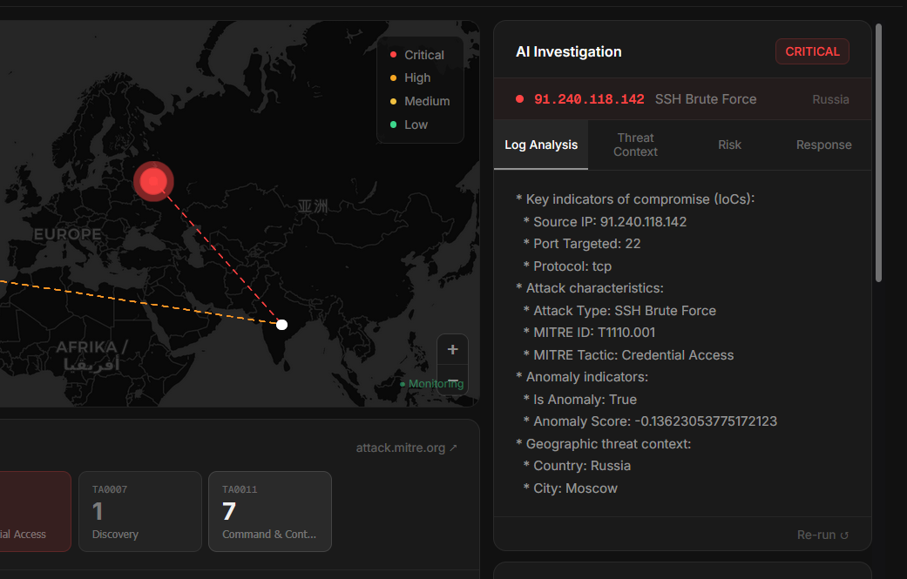

<div align="center">

# 🛡️ HoneyCloud Sentinel

### AI-Driven Adaptive Honeypot Intelligence Platform

*Turning attacker behavior into actionable cyber intelligence.*

[](https://python.org)
[](https://fastapi.tiangolo.com)
[](https://nextjs.org)
[](https://kafka.apache.org)
[](https://tensorflow.org)
[](https://n8n.io)
[](LICENSE)

---

**Trained on 14.2 Million Real-World Attack Records from 4 Honeypot Datasets**

[Features](#-features) •
[Architecture](#-system-architecture) •
[Screenshots](#-screenshots) •
[Quick Start](#-quick-start) •
[ML Models](#-ml--ai-engine) •
[Datasets](#-training-dataset) •
[API](#-api-endpoints) •
[n8n Workflow](#-n8n-orchestration)

</div>

---

## 📸 Screenshots

<div align="center">

### SOC Dashboard — Live Attack Overview


### n8n Threat Intelligence Orchestration Workflow


### Global Attack Map — Real-time Geolocation + LIVE/VIEW Toggle


### AI Threat Intelligence Investigation Panel


</div>

---

## 🌟 Overview

HoneyCloud Sentinel is a **production-grade cybersecurity platform** that deploys AI-powered adaptive honeypots to attract, detect, analyze, and predict cyber attacks in real time.

The system captures attacker behavior through intelligent decoy services, streams attack data through Apache Kafka, runs four ML models trained on **14.2 million real attacks**, automatically enriches every threat through a live multi-source intelligence pipeline, maps attacks to the MITRE ATT&CK framework, and displays everything on a professional SOC-grade dashboard.

> **National Level Hackathon — Blue Team Challenge**
> Addresses all problem statement requirements including adaptive honeypots, ML threat detection, real-time visualization, threat intelligence provider collaboration, and AI orchestration frameworks.

---

## ✨ Features

### 🔴 Adaptive Honeypot Engine *(Phase B)*
- **SSH Honeypot** with 4 intelligent deception strategies
- **Behavioral Fingerprinter** — detects Hydra, Medusa, Nmap, Metasploit, Paramiko
- **Attacker Profiler** — classifies into 6 profiles: Scanner, Script Kiddie, Botnet, Credential Stuffer, Targeted, APT Actor
- **Dynamic Response Selection** — deny fast / tarpit / fake login / full fake environment
- **Honeytoken Planting** — fake AWS keys, SSH keys, deploy scripts to trap APT actors
- **Command Intelligence** — collects every command run in fake shell sessions

### 🤖 ML / AI Engine *(Phase 4 + Phase 11)*
- **Isolation Forest** — zero-day anomaly detection, no prior rules needed
- **Random Forest** — 9-class attack classifier, 100% test accuracy
- **K-Means Clustering** — 8 campaign clusters, identifies coordinated botnets
- **LSTM Neural Network** — predicts next likely attack from sequence of 10
- Trained on **14,201,973 real attack records** from 4 datasets

### 🌐 n8n Orchestration Pipeline *(Phase C)*
- Visual workflow: Webhook → Filter → AbuseIPDB → VirusTotal → Cross-Correlation → Decision → Callback
- Automatically processes every HIGH/CRITICAL attack
- Cross-correlates 3 independent sources into single Threat Intel Score (0–100)
- Sends enrichment back to FastAPI — dashboard updates live
- 65+ attacks enriched automatically per demo run

### 🔍 Threat Intelligence Enrichment *(Phase A)*
- **AbuseIPDB** — community abuse reports, confidence scoring
- **VirusTotal** — 94-engine malware detection
- **HoneyCloud ML** — behavioral cross-correlation from 14.2M trained model
- 4-tier classification: CONFIRMED THREAT / HIGH CONFIDENCE / SUSPICIOUS / LOW RISK
- Evidence chain with numbered findings for each enrichment
- Score breakdown showing contribution from each source

### 🎯 MITRE ATT&CK Integration
- Every attack auto-mapped to official framework technique
- Interactive heatmap showing active tactics in real time
- Clickable technique IDs linking to attack.mitre.org
- Covers 9 attack classes across 5 MITRE tactics

### 🕵️ Multi-Agent Threat Investigation
- **Agent 1** — Log Analyzer: extracts IoCs
- **Agent 2** — Threat Investigator: identifies campaigns and actors
- **Agent 3** — Risk Analyst: assesses business impact
- **Agent 4** — Response Recommender: 5 executable actions
- Powered by **Groq API** (Llama 3.3 70B) — on-demand, no auto-calls

### 📊 SOC Dashboard
- Dark military-ops aesthetic — JetBrains Mono + Rajdhani fonts
- Resizable world map with **LIVE** (real-time attack lines) / **VIEW** (fly-to selected attack) toggle
- Custom React popup cards — no Leaflet white borders
- Attack feed with clickable rows → highlights map + opens investigation
- MITRE ATT&CK heatmap with drill-down
- LSTM prediction panel with confidence bars
- n8n status indicator in header
- One-click AI threat report (HTML + PDF)

### 📄 AI Report Generator
- HTML report — dark SOC theme, SVG risk gauge, bar charts, IoC section
- PDF download — professional threat intelligence document
- LLM-written 7-section analysis: Executive Summary, Threat Analysis, Anomaly Findings, Campaign Attribution, Risk Assessment, Recommendations, IoCs

---

## 🏗️ System Architecture

```
┌─────────────────────────────────────────────────────────────────┐
│                     ATTACKER LAYER                              │
│         Internet Attackers → Port 2222 (SSH Honeypot)          │
└──────────────────────────────┬──────────────────────────────────┘
                               │
┌──────────────────────────────▼──────────────────────────────────┐
│                  ADAPTIVE HONEYPOT ENGINE                        │
│  Behavioral Fingerprinter → Attacker Profiler → Response Engine │
│  Strategies: deny_fast | slow_response | fake_success | full_env│
└──────────────────────────────┬──────────────────────────────────┘
                               │ Kafka Topic: honeypot-attacks
┌──────────────────────────────▼──────────────────────────────────┐
│                    APACHE KAFKA                                  │
│              High-throughput log streaming                       │
└──────────────────────────────┬──────────────────────────────────┘
                               │
┌──────────────────────────────▼──────────────────────────────────┐
│                     ML ENGINE (FastAPI)                          │
│  Isolation Forest → Random Forest → K-Means → Risk Scorer       │
│  MITRE Mapper → Geo Location → Timestamp                        │
└───────────────┬──────────────────────────┬──────────────────────┘
                │ HIGH/CRITICAL            │ All attacks
┌───────────────▼──────────────┐  ┌───────▼──────────────────────┐
│     n8n ORCHESTRATION        │  │      ATTACK STORE             │
│  Webhook → AbuseIPDB         │  │   Thread-safe deque(200)      │
│  → VirusTotal → ML Score     │  │   REST API endpoints          │
│  → Cross-Correlation         │  └───────┬──────────────────────┘
│  → Decision → Callback       │          │
└───────────────┬──────────────┘          │
                │ Enrichment              │
┌───────────────▼──────────────────────── ▼──────────────────────┐
│                  4-AGENT TI PIPELINE (On demand)                 │
│  Log Analyzer → Threat Investigator → Risk Analyst → Response   │
│  Powered by: Groq API (Llama 3.3 70B)                          │
└──────────────────────────────┬──────────────────────────────────┘
                               │
┌──────────────────────────────▼──────────────────────────────────┐
│              SOC DASHBOARD (Next.js 14)                          │
│  Live Map · MITRE Heatmap · Attack Feed · Investigation Panel   │
│  Threat Intel Panel · LSTM Prediction · n8n Status Indicator    │
└─────────────────────────────────────────────────────────────────┘
```

---

## 🌐 n8n Orchestration

The n8n visual workflow automatically processes every HIGH/CRITICAL attack through a professional threat intelligence pipeline:

```
Webhook (Attack Received)
        ↓
Filter: HIGH/CRITICAL only
        ↓
AbuseIPDB Lookup
  → Community abuse reports
  → Confidence score (0-100%)
  → Reporter count, ISP, usage type
        ↓
VirusTotal Lookup
  → 94 antivirus engine scan
  → Malicious/suspicious/clean votes
  → Community reputation score
        ↓
Cross-Correlation Engine (JavaScript)
  → AbuseIPDB score: max 45 pts
  → VirusTotal score: max 40 pts
  → ML model score:  max 15 pts
  → Corroboration bonus: +8 pts
  → Final Threat Intel Score: 0-100
        ↓
Decision Branch
  Score ≥ 75 → CONFIRMED THREAT → block_recommended
  Score ≥ 55 → HIGH CONFIDENCE → watchlist_added
  Score ≥ 30 → SUSPICIOUS      → monitoring_increased
  Score < 30 → LOW RISK        → logged
        ↓
POST /n8n/enrichment → FastAPI
  → Attack store updated
  → Dashboard reflects enrichment
  → n8n_processed counter increments
```

**Result:** Every HIGH/CRITICAL attack is automatically enriched with real threat database data. No manual intervention required.

---

## 📊 Training Dataset

| Dataset | Rows | Type | Source |
|---|---|---|---|
| CIC Honeynet 2023 | 13,767,678 | Real network pcap (34 files) | ciciot.unb.ca |
| AWS Honeypot | 406,766 | Cloud honeypot logs | Kaggle |
| Dionaea Honeypot | 27,529 | Malware honeypot | Kaggle |
| Hornet 40 | 8 locations · 40 days | Geographic honeypot stats | Mendeley |
| **TOTAL** | **14,201,973** | **4 real-world sources** | |

### CIC Honeynet Processing Pipeline
```bash
# Extract packets from .pcap files
python -m scripts.extract_pcap_full      # Phase 2.2 — all 34 files

# Merge all datasets
python scripts/merge_datasets.py          # AWS + Dionaea
python -m scripts.merge_with_cic          # Add CIC test
python -m scripts.merge_cic_full          # Final unified dataset

# Train all models
python scripts/train_all_models.py        # RF + IF + KMeans
python scripts/train_lstm.py              # LSTM predictor
```

---

## 🧠 ML / AI Engine

### Isolation Forest — Anomaly Detection
Detects zero-day attacks with no prior rules. Trained on 14.2M samples with `contamination=0.1`. Flags behavioral deviations from baseline honeypot traffic.

### Random Forest — Attack Classifier (9 Classes)

| Attack Class | MITRE Technique | Training Samples |
|---|---|---|
| Port Scan / Other | T1046 | 12,031,938 |
| Web Exploit | T1190 | 1,016,332 |
| SSH Brute Force | T1110.001 | 430,281 |
| Database Attack | T1078.001 | 277,202 |
| Telnet Attack | T1021.004 | 194,055 |
| DNS Attack | T1071.004 | 128,538 |
| SMB Attack | T1021.002 | 81,510 |
| FTP Attack | T1071.002 | 31,248 |
| Email Attack | T1566.001 | 10,869 |

### K-Means Clustering — Campaign Detection
8 clusters identifying coordinated attack campaigns. Groups attacks by behavioral similarity to detect botnets and APT campaigns.

### LSTM Neural Network — Attack Prediction
Sequence length: 10 attacks. Architecture: `Embedding(16) → LSTM(64) → Dropout(0.2) → LSTM(32) → Dropout(0.2) → Dense(softmax)`. Predicts next likely attack type with probability distribution.

### Risk Scorer — 4-Tier Classification
```
login_attempts ≤ 2 AND connection_rate ≤ 3.0 → LOW (background noise)
Otherwise:
  Attack type weight + Confidence boost + Anomaly boost + Port boost
  → Score 0-100 → LOW / MEDIUM / HIGH / CRITICAL
```

---

## 🚀 Quick Start

### Prerequisites
```
Python 3.10+    Node.js 18+    Docker Desktop    Git
Groq API key    AbuseIPDB API key    VirusTotal API key
```

All three API keys are **free** with no credit card required.

### 1. Clone
```bash
git clone https://github.com/YOUR_USERNAME/HoneyCloud-Sentinel.git
cd HoneyCloud-Sentinel
```

### 2. Python Environment
```bash
python -m venv venv

# Windows
venv\Scripts\activate

# Mac/Linux
source venv/bin/activate

pip install -r requirements.txt
```

### 3. Environment Variables
```bash
cp .env.example .env
```

Edit `.env`:
```env
GROQ_API_KEY=your-groq-key-here
ABUSEIPDB_API_KEY=your-abuseipdb-key-here
VIRUSTOTAL_API_KEY=your-virustotal-key-here
N8N_WEBHOOK_URL=http://localhost:5678/webhook/honeypot-attack
```

### 4. Start Infrastructure
```bash
# Kafka + Zookeeper + n8n
docker-compose up -d

# Verify all running
docker-compose ps
```

### 5. Train ML Models
```bash
# Download datasets first (see datasets/README.md for links)

# Process CIC Honeynet pcap files
python -m scripts.extract_pcap_full

# Merge all datasets
python scripts/merge_datasets.py
python -m scripts.merge_cic_full

# Train models (~5 minutes)
python scripts/train_all_models.py
python scripts/train_lstm.py

# Verify
python scripts/diagnose.py
```

### 6. Import n8n Workflow
```
1. Open http://localhost:5678
2. New Workflow → ⋯ menu → Import from JSON
3. Paste contents of n8n_workflow.json
4. Add your API keys in AbuseIPDB and VirusTotal nodes
5. Save → Activate (green toggle)
```

### 7. Start API
```bash
uvicorn api.threat_api:app --host 0.0.0.0 --port 8000
```

### 8. Start Dashboard
```bash
cd dashboard
npm install
npm run dev
```

### 9. Start Adaptive Honeypot
```bash
python -m honeypots.ssh_honeypot
```

### 10. Run Demo
```bash
python scripts/demo.py          # Full 5-phase demo (~3 min)
python scripts/demo.py --quick  # Quick 30-second demo
```

Open **http://localhost:3000**

---

## 🎬 Demo Script

```bash
python scripts/demo.py
```

| Phase | What Happens | Expected Risk |
|---|---|---|
| 0 | Background internet noise | LOW — correctly filtered |
| 1 | Slow reconnaissance scans | MEDIUM — port scan detected |
| 2 | Botnet wave — 20 coordinated IPs | HIGH — campaign clustered |
| 3 | APT scenario — multi-vector same IP | CRITICAL — anomaly flagged |
| 4 | Mass attack flood — 40 rapid attacks | CRITICAL — feed scrolling |
| 5 | Database breach — 3 simultaneous IPs | CRITICAL — MITRE mapped |

Reset between runs:
```bash
curl -X DELETE http://localhost:8000/attacks/clear
```

---

## 🐝 Adaptive Honeypot Strategies

| Attacker Profile | Detection | Strategy | Purpose |
|---|---|---|---|
| Scanner | Single hit, fast | `deny_fast` | Don't waste resources |
| Script Kiddie | Bot, wordlist | `deny_fast` | Reject immediately |
| Botnet Node | Rapid, coordinated | `slow_response` | Tarpit — waste CPU |
| Credential Stuffer | Many user:pass combos | `fake_success` | Collect credentials used |
| Targeted Attacker | Human timing, specific users | `fake_success` | Collect TTPs |
| APT Actor | Slow, deliberate, admin users | `full_fake_env` | Maximum intelligence |

### Honeytokens Planted (Full Fake Environment)
```
credentials.txt  → Fake AWS access key + secret
.ssh/id_rsa      → Fake RSA private key
deploy.sh        → Fake database credentials + internal IPs
```
When accessed, honeytoken hit is logged and flagged in dashboard.

---

## 🌐 API Endpoints

| Method | Endpoint | Description |
|---|---|---|
| GET | `/` | API info |
| GET | `/health` | System health |
| POST | `/analyze` | Analyze attack through ML pipeline |
| GET | `/attacks` | Recent attacks (newest first) |
| GET | `/stats` | Aggregated statistics |
| GET | `/live` | SSE real-time stream |
| DELETE | `/attacks/clear` | Reset attack store |
| GET | `/mitre/heatmap` | ATT&CK tactic frequency |
| GET | `/mitre/detail/{type}` | Full MITRE entry |
| GET | `/investigations` | TI agent reports |
| POST | `/investigate` | Trigger AI investigation (force=True) |
| GET | `/predict/next` | LSTM next attack prediction |
| POST | `/predict/train` | Retrain LSTM |
| GET | `/report/html` | Visual HTML threat report |
| GET | `/report/generate` | Download PDF report |
| GET | `/intel/{ip}` | Manual threat intel lookup |
| GET | `/intel/stats/summary` | Enrichment statistics |
| POST | `/n8n/enrichment` | n8n enrichment callback |
| GET | `/n8n/status` | n8n pipeline status |
| GET | `/honeypot/stats` | Adaptive honeypot statistics |

**Interactive docs:** http://localhost:8000/docs

---

## 📁 Project Structure

```
HoneyCloud-Sentinel/
│
├── api/
│   ├── threat_api.py              # FastAPI — 19 endpoints
│   └── attack_store.py            # Thread-safe attack + investigation store
│
├── honeypots/
│   ├── ssh_honeypot.py            # Adaptive SSH honeypot (Phase B)
│   ├── behavioral_fingerprinter.py # Tool detection + timing analysis
│   ├── attacker_profiler.py        # ML-based profile classifier
│   └── adaptive_response.py        # 4 deception strategy engines
│
├── ml_models/
│   ├── feature_engineering.py     # 7-feature extractor
│   ├── anomaly_detection.py       # Isolation Forest
│   ├── attack_classifier.py       # Random Forest (9 classes)
│   ├── clustering.py              # K-Means (8 clusters)
│   ├── risk_scorer.py             # 0-100 behavioral risk scoring
│   └── PredictionEngine/
│       └── attack_predictor.py    # LSTM sequence predictor
│
├── ai_agents/
│   ├── mitre_mapper.py            # MITRE ATT&CK lookup table
│   ├── threat_intel_engine.py     # AbuseIPDB + VT + ML enrichment
│   ├── threat_intelligence_agent.py # 4-agent Groq pipeline
│   ├── threat_report_agent.py     # LLM report writer
│   ├── html_report_generator.py   # Dark SOC HTML report
│   └── pdf_generator.py           # ReportLab PDF generator
│
├── dashboard/                     # Next.js 14 frontend
│   ├── app/
│   │   ├── page.tsx               # Main SOC dashboard
│   │   ├── globals.css            # Dark military theme
│   │   └── layout.tsx
│   └── components/
│       ├── Header.tsx             # n8n status + LIVE indicator
│       ├── StatCards.tsx          # CRITICAL/HIGH/MEDIUM/LOW cards
│       ├── AttackMap.tsx          # Leaflet map + LIVE/VIEW toggle
│       ├── Charts.tsx             # Attack type + country charts
│       ├── MitreHeatmap.tsx       # Interactive ATT&CK heatmap
│       ├── AttackFeed.tsx         # Clickable live attack feed
│       ├── InvestigationPanel.tsx # 4-agent AI investigation
│       ├── ThreatIntelPanel.tsx   # n8n + AbuseIPDB + VT display
│       ├── PredictionPanel.tsx    # LSTM prediction engine
│       └── ReportButton.tsx       # HTML + PDF report buttons
│
├── scripts/
│   ├── demo.py                    # 5-phase attack demonstration
│   ├── train_all_models.py        # Train RF + IF + KMeans
│   ├── train_lstm.py              # Train LSTM predictor
│   ├── extract_pcap_test.py       # CIC Phase 2.1 (3 test files)
│   ├── extract_pcap_full.py       # CIC Phase 2.2 (all 34 files)
│   ├── merge_datasets.py          # AWS + Dionaea merge
│   ├── merge_with_cic.py          # Add CIC test data
│   ├── merge_cic_full.py          # Final unified dataset
│   ├── fix_dionaea.py             # Fix corrupted CSV headers
│   └── diagnose.py                # System health check
│
├── datasets/
│   └── README.md                  # Dataset download links
│
├── docs/
│   └── screenshots/               # Dashboard screenshots
│
├── logs/
│   └── ssh_adaptive.json          # Adaptive honeypot session logs
│
├── models/                        # Trained model files (.pkl, .keras)
├── n8n_workflow.json              # Import into n8n directly
├── docker-compose.yml             # Kafka + Zookeeper + n8n
├── requirements.txt
├── .env.example
└── README.md
```

---

## 🛠️ Tech Stack

| Layer | Technology | Purpose |
|---|---|---|
| Honeypot | Python sockets | Adaptive SSH decoy |
| Streaming | Apache Kafka 3.0 | High-throughput event pipeline |
| Orchestration | n8n | Visual threat intel workflow |
| Backend | Python 3.10, FastAPI | 19 REST endpoints |
| ML | Scikit-learn, TensorFlow | 4 trained models |
| AI Pipeline | Groq API, Llama 3.3 70B | On-demand investigation |
| Threat Intel | AbuseIPDB, VirusTotal | Live IP reputation |
| Frontend | Next.js 14, Tailwind | SOC dashboard |
| Visualization | Recharts, Leaflet | Charts + world map |
| Reports | ReportLab, HTML/CSS | PDF + HTML generation |
| DevOps | Docker, Docker Compose | Container orchestration |
| Framework | MITRE ATT&CK | Threat classification |

---

## 🔐 Ethical Considerations

- Honeypots simulate vulnerable environments — no real systems exposed
- No offensive actions taken against attackers
- Attack data anonymized in reports
- Malware isolated in sandboxed honeypot environment
- Complies with responsible cybersecurity research standards
- API keys stored in `.env` — never committed to repository

---

## 🔮 Future Roadmap

1. **T-Pot Integration** — connect to real cloud honeypot platform with 20+ services
2. **Global Honeypot Network** — deploy across AWS, GCP, Azure regions simultaneously
3. **CERT-In Integration** — share threat signatures with national cybersecurity authority
4. **Shodan Enrichment** — add exposed port and vulnerability data to attacker profiles
5. **Automated Defense** — auto-update firewall rules from confirmed threat detections
6. **Full MITRE Coverage** — expand from 9 to all 14 ATT&CK tactic categories
7. **VirusTotal Rate Limiting** — per-IP cooldown to handle high-volume demos

---

## 📈 Project Metrics

```
Training Data:    14,201,973 real attack records
Datasets Used:    4 (CIC Honeynet, AWS, Dionaea, Hornet 40)
ML Models:        4 (Isolation Forest, Random Forest, K-Means, LSTM)
Attack Classes:   9
API Endpoints:    19
Deception Strategies: 4
Attacker Profiles:    6
Intel Sources:    3 (AbuseIPDB, VirusTotal, HoneyCloud ML)
n8n Nodes:        7 (Webhook, Filter, AbuseIPDB, VT, Correlation, Decision, Callback)
Dashboard Panels: 8
```

---

## 🚦 System Requirements

```
OS:      Windows 10/11, Ubuntu 20.04+, macOS 12+
RAM:     8GB minimum, 16GB recommended
Storage: 20GB for datasets + models
CPU:     4 cores recommended for training
Docker:  Docker Desktop with 4GB memory allocated
Python:  3.10 or higher
Node.js: 18 or higher
```

---

<div align="center">

**HoneyCloud Sentinel**

*Transforming attacker behavior into actionable cyber intelligence.*

Built with ❤️ for the National Level Hackathon — Blue Team Challenge

⭐ Star this repo if you found it useful

</div>