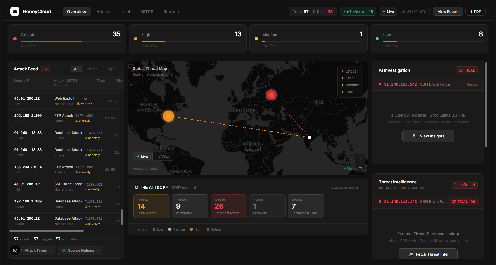

<div align="center">

# 🛡️ HoneyCloud Sentinel

### AI-Driven Adaptive Honeypot Intelligence Platform
### for Real-Time Cyber Threat Detection ...

*Turning attacker behavior into actionable cyber intelligence.*

[](https://python.org)
[](https://fastapi.tiangolo.com)
[](https://nextjs.org)
[](https://kafka.apache.org)
[](https://tensorflow.org)
[](https://n8n.io)
[](LICENSE)

---

**Trained on 14.2 Million Real-World Attack Records from 4 Honeypot Datasets**

[Features](#-features) •
[Architecture](#-architecture) •
[Screenshots](#-screenshots) •
[Quick Start](#-quick-start) •
[ML Models](#-ml-models) •
[Datasets](#-training-dataset) •
[API](#-api-endpoints) •
[n8n Workflow](#-n8n-orchestration-pipeline)

</div>

---

## 📸 Screenshots

<div align="center">


### SOC Dashboard — Live Attack Overview


</div>

---

## 🌟 Overview

HoneyCloud Sentinel is a **production-grade cybersecurity platform** that deploys AI-powered adaptive honeypots to attract, detect, analyze, and predict cyber attacks in real time.

The system captures attacker behavior through intelligent decoy services, streams attack data through Apache Kafka, runs four ML models trained on **14.2 million real attacks**, enriches every HIGH/CRITICAL threat through an automated n8n intelligence pipeline, maps attacks to MITRE ATT&CK, and displays everything on a professional SOC-grade dashboard.

> **National Level Hackathon — Blue Team Challenge**
> Fully addresses all problem statement requirements: adaptive honeypots, ML threat detection, real-time visualization, threat intelligence provider collaboration, and AI orchestration framework (n8n).

---

## ✨ Features

### 🐝 Adaptive Honeypot Engine *(New — Phase B)*
- **Behavioral Fingerprinter** — detects Hydra, Medusa, Nmap, Metasploit, Paramiko from client banners and timing
- **6 Attacker Profiles** — Scanner, Script Kiddie, Botnet Node, Credential Stuffer, Targeted, APT Actor
- **4 Deception Strategies** — deny fast / slow response (tarpit) / fake login / full fake environment
- **Honeytoken Planting** — fake AWS credentials, SSH keys, deploy scripts trap APT actors
- **Command Intelligence** — collects every command run in fake shell sessions
- **Rich Kafka Telemetry** — behavioral data, profile, strategy all flow to dashboard

### 🌐 n8n Orchestration Pipeline *(New — Phase C)*
- Visual workflow — Webhook → Filter → AbuseIPDB → VirusTotal → Cross-Correlation → Decision → Callback
- Processes every HIGH/CRITICAL attack automatically with no manual intervention
- Cross-correlates 3 independent sources into single Threat Intel Score (0–100)
- Full audit trail in n8n Executions panel
- n8n status badge in dashboard header — shows ACTIVE + processed count live

### 🔍 Threat Intelligence Enrichment *(New — Phase A)*
- **AbuseIPDB** — community confidence score, abuse reports, ISP, Tor/VPN/Proxy detection
- **VirusTotal** — 94 antivirus engine scan, reputation, categories
- **HoneyCloud ML** — behavioral cross-correlation from 14.2M trained model
- Score breakdown — AbuseIPDB (max 45) + VirusTotal (max 40) + ML (max 15) + corroboration bonus
- 4-tier output: CONFIRMED THREAT / HIGH CONFIDENCE / SUSPICIOUS / LOW RISK
- Evidence chain with numbered findings — fully auditable

### 🔴 Real-Time Detection
- **SSH Honeypot** — captures brute force and credential attacks on port 2222
- **Kafka streaming pipeline** — zero-latency attack log processing
- **IP Geolocation** — maps every attacker to country and city in real time
- **Server-Sent Events** — dashboard updates instantly without polling
- **Risk Scorer** — background noise correctly scored LOW, real attacks escalated

### 🤖 ML / AI Engine
- **Isolation Forest** — detects zero-day anomalous attacks with no prior rules
- **Random Forest** — classifies 9 attack types with confidence scores
- **K-Means Clustering** — groups attacks into 8 coordinated campaign clusters
- **LSTM Neural Network** — predicts next likely attack from sequence of 10

### 🎯 MITRE ATT&CK Integration
- Every attack auto-mapped to official MITRE technique ID and tactic
- Interactive heatmap showing which tactics are most active right now
- Clickable technique IDs open attack.mitre.org directly
- Covers 9 attack classes across 5 MITRE tactics

### 🕵️ Multi-Agent Threat Investigation
- **Agent 1** — Log Analyzer: extracts Indicators of Compromise
- **Agent 2** — Threat Investigator: identifies campaigns and actor types
- **Agent 3** — Risk Analyst: assesses business impact
- **Agent 4** — Response Recommender: 5 numbered executable actions
- Powered by **Groq API** (Llama 3.3 70B) — on-demand only, rate limit safe

### 📊 SOC Dashboard
- Dark military-ops aesthetic — JetBrains Mono + Rajdhani, cyan on #080c14
- **Resizable world map** — drag handles for width and height
- **LIVE / VIEW toggle** on map — LIVE shows attack lines, VIEW flies to attacker city
- Custom React popup cards — no Leaflet white borders
- Clickable attack feed → highlights row + updates map + opens investigation
- MITRE heatmap with drill-down to technique IDs
- LSTM prediction panel with probability distribution per class
- n8n status indicator in header
- One-click AI report (HTML + PDF)

### 📄 AI Report Generator
- **HTML report** — dark SOC theme, SVG risk gauge, bar charts, IoC section
- **PDF download** — professional threat intelligence document
- LLM-written 7-section analysis including IoCs and campaign attribution

---

## 🏗️ Architecture

```
Internet Attackers
        │
        ▼
┌─────────────────────────────────────────────┐
│         ADAPTIVE HONEYPOT ENGINE             │
│  Behavioral Fingerprinter                   │
│  Attacker Profiler (6 profiles)             │
│  Deception Strategy (4 strategies)          │
│  Honeytoken Planting                        │
└──────────────────┬──────────────────────────┘
                   │ Kafka: honeypot-attacks
                   ▼
┌─────────────────────────────────────────────┐
│              APACHE KAFKA                    │
│         High-throughput log streaming        │
└──────────────────┬──────────────────────────┘
                   │
                   ▼
┌─────────────────────────────────────────────┐
│           ML ENGINE (FastAPI)                │
│  Isolation Forest → Random Forest           │
│  K-Means → Risk Scorer → MITRE Mapper      │
└──────────┬──────────────────────┬───────────┘
           │ HIGH/CRITICAL         │ All attacks
           ▼                       ▼
┌──────────────────────┐  ┌────────────────────┐
│   n8n WORKFLOW       │  │   ATTACK STORE     │
│   AbuseIPDB          │  │   deque(200)       │
│   VirusTotal         │  │   REST API         │
│   Cross-Correlate    │  └─────────┬──────────┘
│   Callback API       │            │
└──────────────────────┘            ▼
                         ┌────────────────────────┐
                         │  4-AGENT TI PIPELINE   │
                         │  (On-demand via Groq)  │
                         └────────────┬───────────┘
                                      │
                                      ▼
┌─────────────────────────────────────────────────────┐
│               SOC DASHBOARD (Next.js 14)             │
│  Map · MITRE Heatmap · Attack Feed                  │
│  Investigation · Threat Intel · LSTM · Reports      │
└─────────────────────────────────────────────────────┘
```

---

## 🌐 n8n Orchestration Pipeline

```
Webhook Trigger (POST from FastAPI)
        ↓
Filter: HIGH or CRITICAL risk only
        ↓
AbuseIPDB → VirusTotal → Cross-Correlation Engine
        ↓
Score ≥ 75 → CONFIRMED THREAT  → block_recommended
Score ≥ 55 → HIGH CONFIDENCE   → watchlist_added
Score ≥ 30 → SUSPICIOUS        → monitoring_increased
Score < 30 → LOW RISK          → logged
        ↓
POST /n8n/enrichment → FastAPI → Dashboard updated
```

Import `n8n_workflow.json` → add API keys in nodes → Activate.

---

## 🐝 Adaptive Honeypot Profiles

| Profile | Detection | Strategy | Purpose |
|---|---|---|---|
| Scanner | Single hit | `deny_fast` | Save resources |
| Script Kiddie | Bot, wordlist | `deny_fast` | Immediate reject |
| Botnet Node | Rapid, automated | `slow_response` | Tarpit attacker |
| Credential Stuffer | Many user:pass | `fake_success` | Collect credentials |
| Targeted | Human, specific | `fake_success` | Gather TTPs |
| APT Actor | Slow, admin users | `full_fake_env` | Maximum intel |

---

## 📊 Training Dataset

| Dataset | Rows | Type | Source |
|---|---|---|---|
| CIC Honeynet 2023 | 13,767,678 | Real network pcap (34 files) | ciciot.unb.ca |
| AWS Honeypot | 406,766 | Cloud honeypot logs | Kaggle |
| Dionaea Honeypot | 27,529 | Malware honeypot | Kaggle |
| Hornet 40 | 8 locations · 40 days | Geographic stats | Mendeley |
| **TOTAL** | **14,201,973** | **4 real-world sources** | |

---

## 🚀 Quick Start

### Prerequisites
```
Python 3.10+   Node.js 18+   Docker Desktop   Git
Groq API key (free)   AbuseIPDB API key (free)   VirusTotal API key (free)
```

### 1. Clone
```bash
git clone https://github.com/YOUR_USERNAME/HoneyCloud-Sentinel.git
cd HoneyCloud-Sentinel
```

### 2. Python Environment
```bash
python -m venv venv
venv\Scripts\activate        # Windows
source venv/bin/activate     # Mac/Linux
pip install -r requirements.txt
```

### 3. Environment Variables
```bash
cp .env.example .env
```
```env
GROQ_API_KEY=your-groq-key-here
ABUSEIPDB_API_KEY=your-abuseipdb-key-here
VIRUSTOTAL_API_KEY=your-virustotal-key-here
N8N_WEBHOOK_URL=http://localhost:5678/webhook/honeypot-attack
```

### 4. Start Infrastructure
```bash
docker-compose up -d    # Kafka + Zookeeper + n8n
```

### 5. Train ML Models
```bash
python -m scripts.extract_pcap_full     # Process CIC pcap files
python scripts/merge_datasets.py         # Merge all datasets
python scripts/train_all_models.py       # Train RF + IF + KMeans
python scripts/train_lstm.py             # Train LSTM predictor
python scripts/diagnose.py               # Verify all models loaded
```

### 6. Import n8n Workflow
```
1. Open http://localhost:5678
2. New Workflow → ⋯ → Import from JSON → paste n8n_workflow.json
3. Open AbuseIPDB node → add API key in Header value
4. Open VirusTotal node → add API key in Header value
5. Save → Activate (green toggle)
```

### 7. Start Services
```bash
# Terminal 1 — API
uvicorn api.threat_api:app --host 0.0.0.0 --port 8000

# Terminal 2 — Dashboard
cd dashboard && npm install && npm run dev

# Terminal 3 — Adaptive Honeypot
python -m honeypots.ssh_honeypot
```

### 8. Run Demo
```bash
python scripts/demo.py          # Full 5-phase demo (~3 min)
python scripts/demo.py --quick  # Quick 30-second demo
```

Open **http://localhost:3000**

---

## 🧠 ML Models

### Random Forest — Attack Classifier (9 Classes)

| Class | MITRE Technique | Tactic | Training Samples |
|---|---|---|---|
| Port Scan / Other | T1046 | Discovery | 12,031,938 |
| Web Exploit | T1190 | Initial Access | 1,016,332 |
| SSH Brute Force | T1110.001 | Credential Access | 430,281 |
| Database Attack | T1078.001 | Persistence | 277,202 |
| Telnet Attack | T1021.004 | Lateral Movement | 194,055 |
| DNS Attack | T1071.004 | Command & Control | 128,538 |
| SMB Attack | T1021.002 | Lateral Movement | 81,510 |
| FTP Attack | T1071.002 | Command & Control | 31,248 |
| Email Attack | T1566.001 | Initial Access | 10,869 |

### Isolation Forest — Anomaly Detection
Trained on 14.2M samples (`contamination=0.1`). Detects zero-day attacks with no prior rules. Effective against novel attack patterns unseen in training.

### K-Means Clustering — Campaign Detection
8 clusters identifying coordinated botnets and APT campaigns across multiple IPs. Groups attacks by behavioral similarity patterns.

### LSTM Neural Network — Attack Prediction
Sequence length 10. Architecture: `Embedding(16) → LSTM(64) → Dropout → LSTM(32) → Dropout → Dense(softmax)`. Outputs probability distribution across all 9 attack classes.

### Risk Scorer — 4-Tier Classification
```
Background noise (low attempts + low rate) → 🟢 LOW
Attack type weight + confidence + anomaly  → MEDIUM / HIGH / CRITICAL
```

---

## 🌐 API Endpoints

| Method | Endpoint | Description |
|---|---|---|
| GET | `/` | API info |
| GET | `/health` | System health |
| POST | `/analyze` | Full ML pipeline analysis |
| GET | `/attacks` | Recent attacks (newest first) |
| GET | `/stats` | Aggregated statistics |
| GET | `/live` | SSE real-time attack stream |
| DELETE | `/attacks/clear` | Reset attack store |
| GET | `/mitre/heatmap` | ATT&CK tactic frequency |
| GET | `/mitre/detail/{type}` | Full MITRE entry |
| GET | `/investigations` | TI agent reports |
| POST | `/investigate` | Trigger AI investigation |
| GET | `/predict/next` | LSTM prediction |
| POST | `/predict/train` | Retrain LSTM |
| GET | `/report/html` | Visual HTML report |
| GET | `/report/generate` | Download PDF report |
| GET | `/intel/{ip}` | Manual threat intel lookup |
| GET | `/intel/stats/summary` | Enrichment statistics |
| POST | `/n8n/enrichment` | n8n callback receiver |
| GET | `/n8n/status` | n8n pipeline status |
| GET | `/honeypot/stats` | Adaptive honeypot stats |

**Interactive docs:** http://localhost:8000/docs

---

## 📁 Project Structure

```
HoneyCloud-Sentinel/
│
├── api/
│   ├── threat_api.py                # FastAPI — 20 endpoints
│   └── attack_store.py              # Thread-safe attack + investigation store
│
├── honeypots/
│   ├── ssh_honeypot.py              # Adaptive SSH honeypot
│   ├── behavioral_fingerprinter.py  # Tool detection + timing analysis
│   ├── attacker_profiler.py         # ML-based profile classifier
│   └── adaptive_response.py         # 4 deception strategy engines
│
├── ml_models/
│   ├── feature_engineering.py       # 7-feature extractor
│   ├── anomaly_detection.py         # Isolation Forest
│   ├── attack_classifier.py         # Random Forest (9 classes)
│   ├── clustering.py                # K-Means (8 clusters)
│   ├── risk_scorer.py               # 0-100 risk scoring
│   └── PredictionEngine/
│       └── attack_predictor.py      # LSTM sequence predictor
│
├── ai_agents/
│   ├── mitre_mapper.py              # MITRE ATT&CK mapping
│   ├── threat_intel_engine.py       # AbuseIPDB + VT + ML enrichment
│   ├── threat_intelligence_agent.py # 4-agent Groq pipeline
│   ├── threat_report_agent.py       # LLM report writer
│   ├── html_report_generator.py     # HTML report generator
│   └── pdf_generator.py             # PDF generator
│
├── dashboard/                       # Next.js 14 frontend
│   ├── app/
│   │   ├── page.tsx                 # Main SOC dashboard
│   │   └── globals.css              # Dark military theme
│   └── components/
│       ├── Header.tsx               # n8n status + LIVE indicator
│       ├── StatCards.tsx            # Risk level stat cards
│       ├── AttackMap.tsx            # Leaflet map + LIVE/VIEW toggle
│       ├── Charts.tsx               # Attack type + country charts
│       ├── MitreHeatmap.tsx         # Interactive ATT&CK heatmap
│       ├── AttackFeed.tsx           # Clickable live attack feed
│       ├── InvestigationPanel.tsx   # 4-agent AI investigation
│       ├── ThreatIntelPanel.tsx     # Threat intel enrichment display
│       ├── PredictionPanel.tsx      # LSTM prediction engine
│       └── ReportButton.tsx         # HTML + PDF report buttons
│
├── scripts/
│   ├── demo.py                      # 5-phase attack demonstration
│   ├── train_all_models.py          # Train RF + IF + KMeans
│   ├── train_lstm.py                # Train LSTM
│   ├── extract_pcap_test.py         # CIC Phase 2.1 test
│   ├── extract_pcap_full.py         # CIC Phase 2.2 full batch
│   ├── merge_datasets.py            # AWS + Dionaea merge
│   ├── merge_with_cic.py            # Add CIC test data
│   ├── merge_cic_full.py            # Final dataset merge
│   ├── fix_dionaea.py               # Fix corrupted CSV headers
│   └── diagnose.py                  # System health check
│
├── datasets/
│   └── README.md                    # Dataset download links
│
├── docs/
│   └── screenshots/                 # Dashboard screenshots
│
├── logs/
│   └── ssh_adaptive.json            # Adaptive honeypot logs
│
├── models/                          # Trained model files (.pkl, .keras)
├── n8n_workflow.json                # Import directly into n8n
├── docker-compose.yml               # Kafka + Zookeeper + n8n
├── requirements.txt
├── .env.example
└── README.md
```

---

## 🎬 Demo

| Phase | What Happens | Risk Level |
|---|---|---|
| 0 | Background internet noise | 🟢 LOW — correctly filtered |
| 1 | Slow reconnaissance | 🟡 MEDIUM — port scan |
| 2 | Botnet wave — 20 IPs | 🟠 HIGH — campaign detected |
| 3 | APT — multi-vector same IP | 🔴 CRITICAL — anomaly flagged |
| 4 | Mass flood — 40 rapid attacks | 🔴 CRITICAL — feed scrolling |
| 5 | DB breach — 3 simultaneous | 🔴 CRITICAL — MITRE T1078 |

```bash
python scripts/demo.py --quick   # 30 seconds
curl -X DELETE http://localhost:8000/attacks/clear   # reset
```

---

## 🔐 Ethical Considerations

- Honeypots simulate vulnerable environments — no real systems exposed
- No offensive actions taken against attackers
- Attack data anonymized in reports
- API keys stored in `.env` — never committed to repository
- Complies with responsible cybersecurity research standards

---

## 🔮 Future Roadmap

1. **T-Pot Integration** — 20+ honeypot service types
2. **Global Honeypot Network** — multi-cloud deployment
3. **CERT-In Integration** — national threat signature sharing
4. **Shodan Enrichment** — exposed port data per attacker
5. **Automated Defense** — auto-update firewall from confirmed threats
6. **Full MITRE Coverage** — all 14 ATT&CK tactic categories

---

## 🛠️ Tech Stack

| Layer | Technology | Purpose |
|---|---|---|
| Honeypot | Python sockets | Adaptive SSH decoy |
| Streaming | Apache Kafka 3.0 | Event pipeline |
| Orchestration | n8n | Visual threat intel workflow |
| Backend | Python 3.10, FastAPI | 20 REST endpoints |
| ML | Scikit-learn, TensorFlow | 4 models, 14.2M samples |
| AI Investigation | Groq API, Llama 3.3 70B | On-demand 4-agent pipeline |
| Threat Intel | AbuseIPDB, VirusTotal | Live IP reputation |
| Frontend | Next.js 14, Tailwind CSS | SOC dashboard |
| Visualization | Recharts, Leaflet | Charts + world map |
| Reports | ReportLab, HTML/CSS | PDF + HTML generation |
| Containers | Docker, Docker Compose | Infrastructure |
| Framework | MITRE ATT&CK | Threat classification standard |

---

## 📈 Project Metrics

```
Training Records:      14,201,973
Datasets:              4
ML Models:             4
Attack Classes:        9
API Endpoints:         20
Deception Strategies:  4
Attacker Profiles:     6
Intel Sources:         3 (AbuseIPDB, VirusTotal, HoneyCloud ML)
n8n Workflow Nodes:    7
Dashboard Panels:      8
```

---

<div align="center">

**HoneyCloud Sentinel**

*Transforming attacker behavior into actionable cyber intelligence.*

Built for the National Level Hackathon — Blue Team Challenge

⭐ Star this repo if you found it useful

</div>